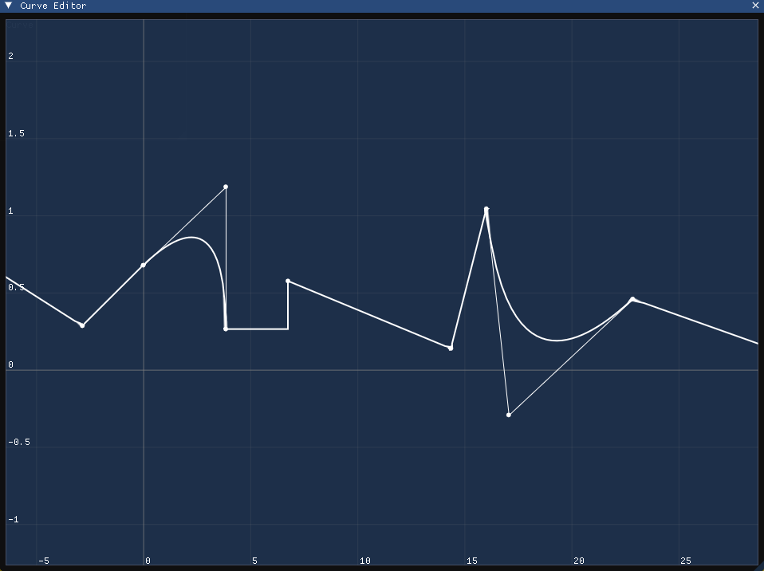

# ImCurve

Unreal-style curve editor and runtime using Dear ImGui



### Features and Controls

- Single and double precision curves
- Square, linear, and quadratic interpolation
- Separated editor and runtime (ImCurveEditor and ImCurve)
- Double LMB to add a point
- LCtrl+LMB to select a point
- LMB+drag on the canvas to select points
- LMB+drag on a point to move selected points
- Delete to remove selected points
- RMB+drag to pan
- Mouse wheel to zoom
- RMB to change the interpolation type
- Ctrl+Z to undo
- Ctrl+R to redo

### Example

```c++
#include <imgui.h>
#include <imcurve_editor.hpp>

class Character
{
public:
    Character()
        : Position{0.0f}
    {
    }

    void Update(float input, float dt)
    {
        float velocity = Velocity.GetCurve().Sample(input);
        Position += velocity * dt;
    }

    void RenderImGui()
    {
        Velocity.Draw("Velocity");
    }

private:
    ImCurveEditor<float> Velocity;
    float Position;
};
```
